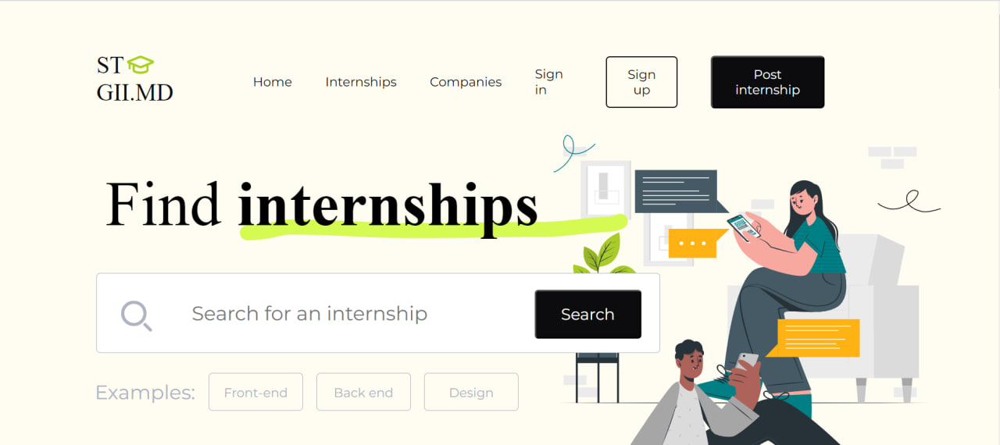
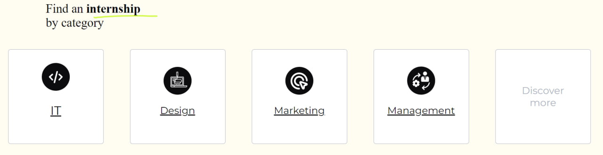
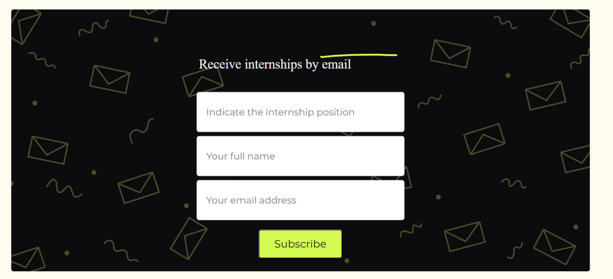
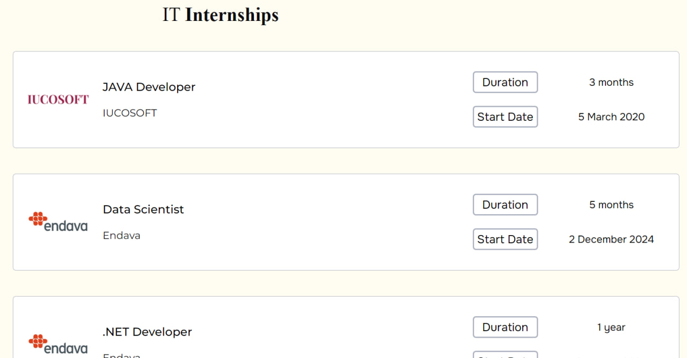
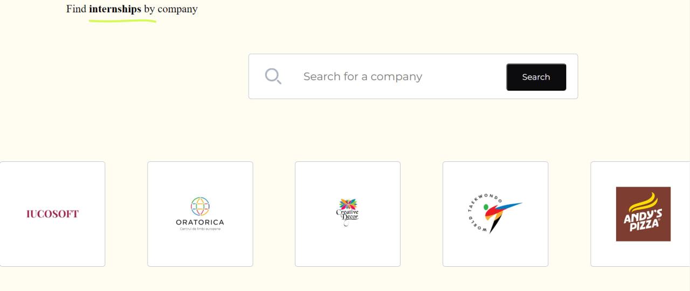

# Stagii.md

## Description

Stagii.md is a specialized platform designed to streamline the internship search process. It connects students and graduates with diverse internship opportunities offered by companies. This README provides essential information for users, contributors, and maintainers.

## Technical Framework and Tools

### Backend:

- **Framework:** The backend of our application is developed using servlets and JSP (JavaServer Pages) within the Tomcat Apache server. Servlets handle the server-side logic, while JSP enables the creation of dynamic web pages.

### Frontend:

- **Languages:** The frontend is built using fundamental web technologies, including HTML for structure, CSS for styling, and JavaScript for dynamic behavior. This approach ensures a lightweight and responsive user interface.

### Database:

- **Database System:** The application's data is stored and managed in a MySQL database. MySQL provides a reliable and scalable relational database solution, facilitating efficient data storage and retrieval.

### Deployment:

- **Backend Deployment:** The backend, powered by servlets and JSP, is deployed using the Tomcat Apache server, providing a robust and efficient runtime environment.

- **Frontend Deployment:** The frontend, consisting of HTML, CSS, and JavaScript, is hosted on a platform like Vercel. Vercel ensures seamless deployment and hosting for static assets, enhancing the overall performance of the frontend.

- **Database Deployment:** The MySQL database is deployed and managed as part of the overall application architecture. It plays a crucial role in storing and retrieving data, ensuring the integrity of the information.

## Visuals

- **Home Page:**
  

- **Find Internship by Category:**
  

- **Receive New Internship Emails:**
  

- **Explore Internship Categories:**
  

- **Explore Registered Companies:**
  

- **Sign Up for Registration:**
  

## Installation

To access Stagii.md, simply click on the following link: [Stagii.md Website](https://internetportal.md/stagiimd/?fbclid=IwAR2m-MGAtU_xOOPggjr_SY8HRskPxFfAK_h7J18hH_6y7hj5QFv03f21rDI).

This one-click link will take you directly to our website, where you can explore internship opportunities and make the most of our platform.

## Usage

To get started with Stagii.md, follow these steps:

1. **Home Page:**
   Click on the [Stagii.md Website](https://internetportal.md/stagiimd/?fbclid=IwAR2m-MGAtU_xOOPggjr_SY8HRskPxFfAK_h7J18hH_6y7hj5QFv03f21rDI) link, and you will land on the home page.
   

2. **Find Internship by Category:**
   Scroll down on the home page to find the section "Find Internship by Category."
   

3. **Receive New Internship Emails:**
   At the bottom of the page, you'll find a form. Complete the form, and you will start receiving emails with new internship postings.
   

4. **Explore Internship Categories:**
   In the header, locate the "Internship" button. Clicking it will lead you to a page with internship categories. Select a category to view all internships within that category.
   

5. **Explore Registered Companies:**
   Similarly, in the header, find the "Companies" button. Clicking it will display a list of all registered companies.
   

6. **Sign Up for Registration:**
   If you wish to register, click on "Sign Up" in the header. You will be directed to a registration form.
   

## Project Status

The Stagii.md project is currently in maintenance. We are actively supporting the platform to ensure a smooth and reliable experience for users. If you have any questions or need assistance, please get in touch.
